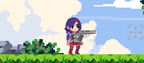
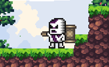
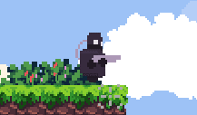
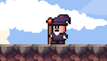
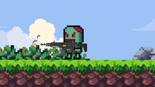
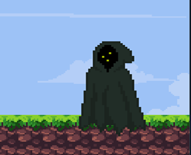
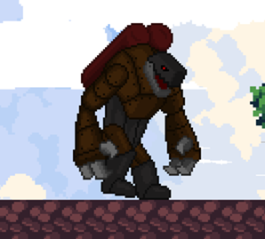
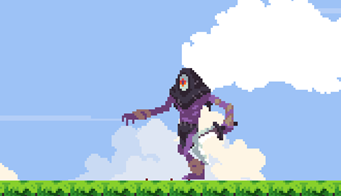

# *`2D PLATFORMER GAME`*
A SIMPLE 2D PLATFORMER GAME MADE IN PYTHON FOR FINAL IT-PROJECT

# *`PLAYABLE CHARACTER`*
+ *Phương*

    

# *`ENEMIES`*
1. *Skeleton*

    

1. *Sniper*

    

1. *Wizard*

    

1. *Zombie*

    

# *`BOSSES`*
1. *Evil Wizard*

    

1. *Ghost*

    

1. *Groudon*

    

1. *Death*

    

# *`MOVEMENTS`*
+ `WASD`: Move Around
+ `LSHIFT`: Dash
+ `LMOUSE`: Shoot
+ `MOUSE SCROLL UP/DOWN`: Change weapon

# *`HOW TO PLAY`*
KILL ALL ENEMIES TO PROGESS TO THE NEXT STAGE

# *`CREDITS`*
ALL ASSETS USED ARE CREDITED IN *`Credits.docx`*